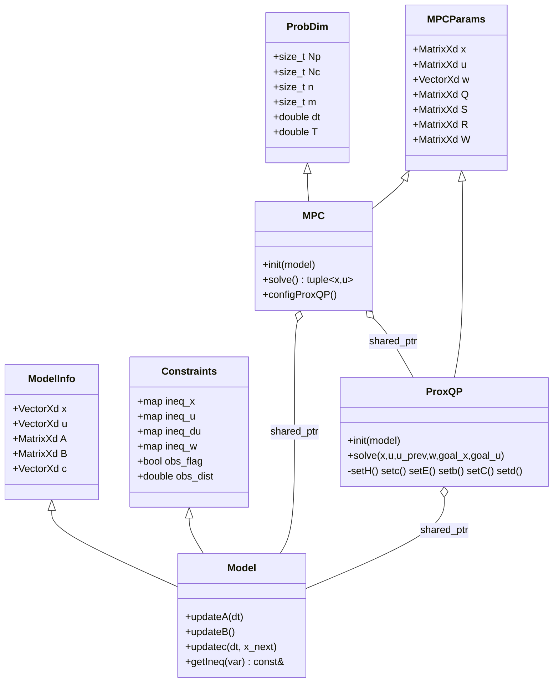
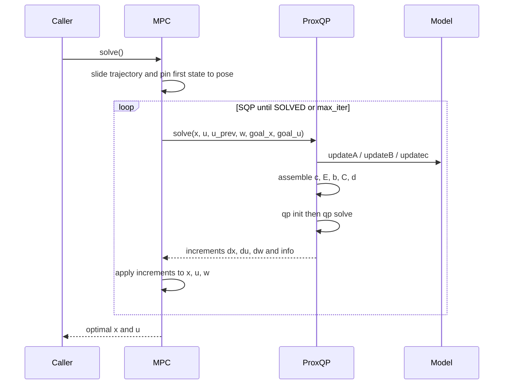

# ProxMPC — Architecture and Technical Reference

This document explains the design of ProxMPC, whose math lives in the
`prox_mpc_core` package: a C++17 nonlinear Model Predictive Control (NMPC)
library.
The controller solves the nonlinear optimal-control problem with a Sequential
Quadratic Programming (SQP) scheme that repeatedly builds and solves a Quadratic
Program (QP) using the ProxQP solver from `proxsuite`, with Eigen for linear
algebra.
All public types live in the `prox_mpc` C++ namespace.

## Scope

`prox_mpc_core` is a **library only**: it contains no ROS 2 node, `main()`,
publisher, subscriber, topic, or launch file.
The only ROS-coupled function is `optimPath()`, which converts an optimal state
trajectory into a `nav_msgs/msg/Path` for visualization.
Two sibling packages consume the core: `prox_mpc_demo` (a self-contained
closed-loop simulation and benchmark) and `prox_mpc_controller` (a Nav2
`nav2_core::Controller` plugin, under development).

## Source layout

```text
prox_mpc_core/include/prox_mpc/
  structs.hpp  ProbDim, MPCParams, ModelInfo, Constraints (plain data)
  model.hpp    Model: vehicle interface (kinematics + constraints)
  proxqp.hpp   ProxQP: QP assembly and solve wrapper
  mpc.hpp      MPC: SQP driver and configuration
  utils.hpp    free functions, Eigen/ROS aliases
  models/      Bicycle (bike) and Unicycle (r2d2) reference kinematic models
prox_mpc_core/src/
  model.cpp    Model getters/setters
  mpc.cpp      MPC::init, MPC::solve (SQP loop), configuration
  proxqp.cpp   ProxQP::init, ProxQP::solve, setH/setc/setE/setb/setC/setd
  utils.cpp    normalizeAngle, computeBox, closestBoxPoints, optimPath
```

## Class structure

`Model`, `MPC`, and `ProxQP` compose the plain-data structs by inheritance.
`Model` describes one vehicle; `MPC` owns the SQP loop and a `ProxQP`; `ProxQP`
assembles and solves a single QP sub-problem.



## The vehicle model interface

A concrete model derives from `Model` and overrides three virtual functions that
supply the first-order (Euler) linearization of the continuous dynamics
$\dot{x} = f(x, u)$ about the current operating point:

- `updateA(dt)` fills $A_k = \partial x_{k+1} / \partial x_k$, the discrete state
  Jacobian.
- `updateB()` fills $B_k = \partial f / \partial u$, the input Jacobian (the
  assembly multiplies it by `dt`).
- `updatec(dt, x_next)` fills the residual $c_k$ of the Euler step.

For a kinematic bicycle with state $x = [p_x, p_y, \theta, \delta]^\top$ and
input $u = [v, \dot{\delta}]^\top$, the Euler residual used by the equality
constraint is

$$
c_k =
\begin{bmatrix}
x_k^{(0)} - x_{k+1}^{(0)} + \Delta t\, v_k \cos(\theta_k + \delta_k) \\
x_k^{(1)} - x_{k+1}^{(1)} + \Delta t\, v_k \sin(\theta_k + \delta_k) \\
x_k^{(2)} - x_{k+1}^{(2)} + \Delta t\, v_k \sin(\delta_k) / L \\
x_k^{(3)} - x_{k+1}^{(3)} + \Delta t\, \dot{\delta}_k
\end{bmatrix}.
$$

## Decision variables and indexing

Each SQP iteration solves a QP whose decision vector $z$ stacks the **state,
control, and slack increments** over the horizon, in this fixed order:

$$
z = \big[\, \underbrace{\Delta x_0, \dots, \Delta x_{N_p}}_{(N_p+1)\,n},\;
            \underbrace{\Delta u_0, \dots, \Delta u_{N_c-1}}_{N_c\,m},\;
            \underbrace{\Delta w_0, \dots, \Delta w_{N_p}}_{N_p+1} \,\big]^\top .
$$

The offsets are

$$
\texttt{x\_start} = 0, \quad
\texttt{u\_start} = (N_p+1)\,n, \quad
\texttt{w\_start} = \texttt{u\_start} + N_c\,m,
$$

and the total dimension is $n_\text{dvars} = (N_p+1)\,n + N_c\,m + (N_p+1)$.
The slack block $\Delta w$ is present only when obstacle avoidance is enabled.

## QP sub-problem

The SQP solves, at each iteration, a convex QP of the form

$$
\min_{z}\; \tfrac{1}{2} z^\top H z + c^\top z
\quad \text{s.t.} \quad E z = b, \quad d_{\text{low}} \le C z \le d_{\text{upp}}.
$$

### Objective (`setH`, `setc`)

The Hessian is block diagonal with the (doubled) weight matrices on the state,
terminal, control, and slack blocks:

$$
H = \operatorname{blkdiag}\big(
\underbrace{2Q, \dots, 2Q}_{N_p},\; 2S,\;
\underbrace{2R, \dots, 2R}_{N_c},\;
\underbrace{2W, \dots, 2W}_{N_p+1} \big).
$$

The linear term is the gradient of the tracking cost evaluated at the current
trajectory iterate:

$$
c =
\begin{bmatrix}
2Q\,(x_k - x_k^{\text{goal}}) \\[2pt]
2S\,(x_{N_p} - x_{N_p}^{\text{goal}}) \\[2pt]
2R\,(u_k - u_k^{\text{goal}}) \\[2pt]
2W\,w_k
\end{bmatrix}.
$$

### Equality constraints (`setE`, `setb`)

Two equality blocks pin the trajectory to the physics:

1. **Initial state.** $\Delta x_0$ is fixed so that $x_0$ equals the measured
   pose (identity block).
2. **Euler dynamics.** For each shooting node,
   $A_k \Delta x_k + (\Delta t\, B_k)\, \Delta u_k - \Delta x_{k+1} = -c_k$.

### Inequality constraints (`setC`, `setd`)

The inequality block enforces, per active constraint and step:

- control-rate (`du`) bounds, including a first-step bound that ties the increment
  to the last applied input $u_{\text{prev}}$,
- state bounds (`x`), control bounds (`u`),
- the **obstacle-avoidance** constraint with a soft slack $w$.

The obstacle constraint linearizes the Euclidean separation between the predicted
position and the obstacle. With $\Delta_x, \Delta_y$ the position offset and the
unit normal guarded against the coincident case,

$$
n_x = \frac{\Delta_x}{\max(\lVert (\Delta_x,\Delta_y)\rVert,\, \varepsilon)},
\qquad
n_y = \frac{\Delta_y}{\max(\lVert (\Delta_x,\Delta_y)\rVert,\, \varepsilon)},
$$

and the row is $n_x\,\Delta x^{(0)} + n_y\,\Delta x^{(1)} + w \ge d_{\min}$, where

$$
d_{\min} = d_\text{obs} + e_\text{robot} + e_\text{obs} -
\lVert (\Delta_x, \Delta_y) \rVert .
$$

Here $e_\text{robot}$ and $e_\text{obs}$ are the edge distances of the closest
points between the robot and obstacle bounding boxes (`computeBox`,
`closestBoxPoints`).

## SQP scheme

`MPC::solve` slides the previous solution forward by one step (warm start), pins
the first state to the current pose, then iterates: build and solve the QP, apply
the increments, repeat until the QP reports `PROXQP_SOLVED` or the iteration cap
is reached.
On non-convergence the first control is zeroed as a safe fallback.

$$
x \mathrel{+}= \Delta x, \quad
u \mathrel{+}= \Delta u, \quad
w \mathrel{+}= \Delta w,
\qquad \text{until } \texttt{status} = \text{SOLVED} \text{ or } k \ge k_{\max}.
$$



## Solver configuration

The QP is solved in **sparse** mode by default (`qp_type = false`); a dense path
exists for small problems (`qp_type = true`).
Warm starting is on by default.
The numeric defaults (`max_ext_qp = 10000`, `max_int_qp = 1500`,
`max_iter_sqp = 100`) are centralized as named constants and overridable through
setters.

## Key interfaces

| Symbol | Type | Meaning |
| --- | --- | --- |
| `MPC::solve()` | `tuple<MatrixXd, MatrixXd>` | optimal state and control trajectories |
| `MPC::setPose(pose)` | `VectorXd` | current measured vehicle state |
| `MPC::setGoalX/GoalU` | `MatrixXd` | reference trajectories |
| `MPC::setObs(obs)` | `MatrixXd` (Np+1 × 2) | obstacle positions per step |
| `optimPath(x, now)` | `nav_msgs/msg/Path` | trajectory as a ROS path message |

## Numerical and resource notes

- All MPC quantities use `double`; the step size `dt`/`T` are `double` to avoid
  silent narrowing.
- The QP assembly runs every SQP iteration and every control step; Eigen
  matrices are passed by `const&` and the constraint maps are returned by
  `const&` to avoid per-iteration heap copies on this hot path.
- `EIGEN_NO_DEBUG` removes Eigen's internal assertions in the Release build.
- The obstacle constraint is numerically sensitive: a coincident robot/obstacle
  position is guarded with an epsilon to avoid injecting `NaN` into the QP.
