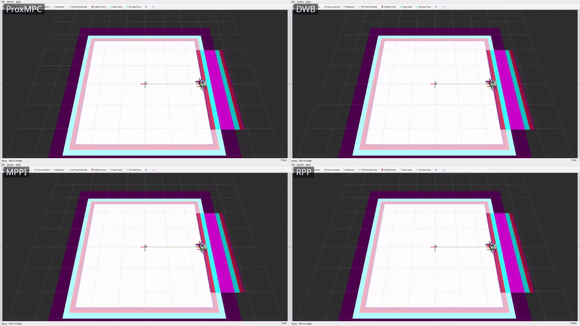
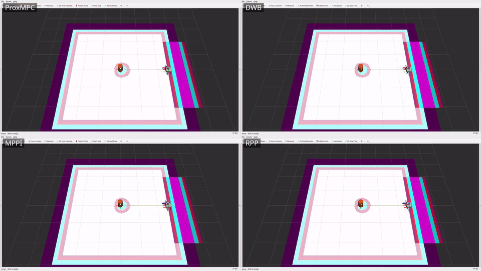
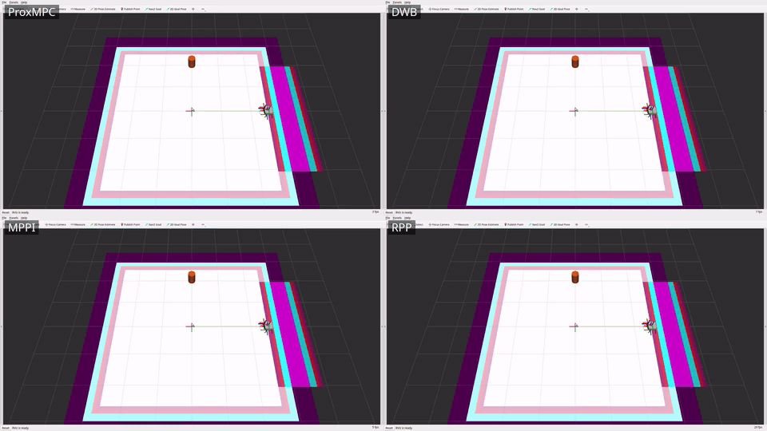
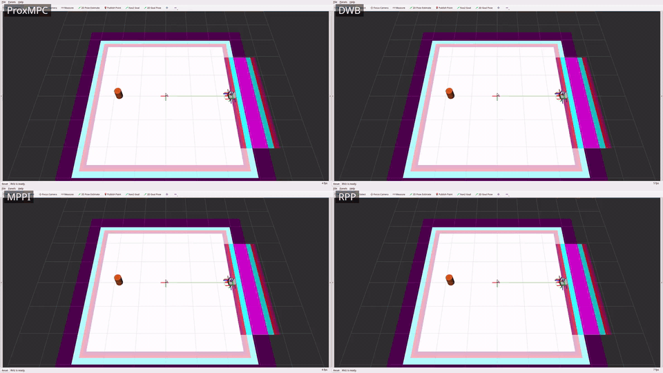

# prox_mpc_benchmark

Scenario-driven benchmarking harness for the ProxMPC stack.
It measures three metric classes - **accuracy** (cross-track / goal error),
**precision** (mean ± std over repeats), and **real-time / feasibility** (solver
diagnostics) - across a matrix of *scenario x model x controller x run mode*.

## Table of Contents

- [Overview](#overview)
- [Prerequisites](#prerequisites)
- [Build](#build)
- [Project Structure](#project-structure)
- [Run modes](#run-modes)
- [Coverage and status](#coverage-and-status)
- [Notes on the metrics](#notes-on-the-metrics)
- [Configuration](#configuration)
- [Usage](#usage)
  - [Quick start](#quick-start)
  - [Standalone matrix (b1)](#standalone-matrix-b1)
  - [Cross-controller comparison (b2)](#cross-controller-comparison-b2)
  - [Aggregate the tables](#aggregate-the-tables)
- [Demonstration videos](#demonstration-videos)
- [Results](#results)
- [License](#license)

## Overview

The package contains a controller-agnostic **C++ live metrics node**
([src/metrics_node.cpp](src/metrics_node.cpp)) plus installed **Python tooling**
([scripts/](scripts/)) for orchestration, map generation, goal sending, bag
reduction, and aggregation. It **reuses** the demo worlds/maps/models rather
than duplicating them, and **owns the result artifacts**, which stay local and
gitignored - the framework performs no git operations.

The narrative companion - how ProxMPC compares against the stock Nav2 controllers
and what the suite concluded - is in
[doc/controller-comparison-results.md](../doc/controller-comparison-results.md).

## Prerequisites

- **Operating system:** Ubuntu 24.04 (Noble).
- **ROS 2 distribution:** Jazzy.
- **Build system:** `ament_cmake`.
- **Always needed:** `prox_mpc_core`, `prox_mpc_msgs`, and `prox_mpc_demo` (the
  reused worlds, maps, and models).
- **Modes a / b2:** additionally Nav2 and the stock Nav2 controllers under
  comparison (DWB, MPPI, Regulated Pure Pursuit, Graceful, and Vector Pursuit -
  the one external community peer), plus `prox_mpc_controller`;
  mode a also needs Gazebo Harmonic and `ros_gz`.

ROS dependencies are declared in `package.xml` and resolved by `rosdep install`.

## Build

Build the harness and its dependencies in an overlay workspace:

```bash
colcon build --symlink-install --packages-select \
  prox_mpc_msgs prox_mpc_core prox_mpc_controller prox_mpc_demo prox_mpc_benchmark
source install/setup.bash
```

## Project Structure

- `config/scenarios/` - eleven scenarios, one YAML each. The four single-obstacle
  motion cells driven by the standalone matrix (`static_box`, `dynamic_circle`,
  `dynamic_line_forward`, `dynamic_line_backward`); `nav2_open`, the obstacle-free
  cross-controller cell; and the six multi-obstacle cells that carry the
  simultaneous two-mover collision comparison - `dynamic_multi`,
  `dynamic_multi_noise`, and `blind_multi_0` through `blind_multi_3`
  (generated by `gen_blind_multi.py`).
- `config/controllers/` - one preset per Nav2 controller under test: `proxmpc`,
  `proxmpc_pred` (the predictive ProxMPC variant), `dwb`, `mppi`,
  `regulated_pure_pursuit`, `graceful`, and `vector_pursuit`.
- `config/robots/` - robot <-> prox_mpc model pairing (`waffle`->Unicycle,
  `ackermann`->Bicycle).
- `config/metrics.yaml` - metric set, pass thresholds, repeats, shared control params.
- `config/nav2_b2_base.yaml` - the shared Nav2 stack the mode-b2 launch injects each controller preset into.
- `src/metrics_node.cpp` - live cross-track/goal-error + SolverDiagnostics tap; writes a per-run JSON.
- `src/kinematic_plant.cpp` - mode (b2) plant: integrates `/cmd_vel` as a unicycle, publishes `/odom` + TF.
- `src/scan_simulator.cpp` - synthesises the `LaserScan` the mode (b2) costmaps and the
  obstacle tracker perceive, so every controller sees the same sensor stream without Gazebo.
- `src/timing_controller_wrapper.cpp` - a `nav2_core::Controller` decorator that wall-clock times the
  wrapped controller's `computeVelocityCommands` so every controller's per-cycle compute is measured identically.
- `timing_controller_plugin.xml` - the `pluginlib` export for that decorator.
- `include/prox_mpc_benchmark/` - `metrics_math.hpp` (the ROS-free metric math),
  `obstacle_field.hpp` (scenario obstacle geometry), and `timing_controller_wrapper.hpp`.
- `test/` - GoogleTest suites `test_metrics.cpp` and `test_obstacle_field.cpp`.
- `launch/benchmark.launch.py` - standalone (b1) sim + metrics node for one scenario x model.
- `launch/benchmark_nav2.launch.py` - mode (b2) Nav2 + kinematic plant with the selected controller preset.
- `launch/interactive.launch.py` - the click-a-goal interactive Nav2 bring-up on the kinematic plant (no Gazebo).
- `scripts/run_matrix.py` - orchestrate the standalone (b1) matrix x repeats.
- `scripts/run_nav2.py` - orchestrate the mode (b2) cross-controller comparison (Nav2 + plant, no Gazebo).
- `scripts/resource_sampler.py` - sample the controller_server process CPU/RSS + `/cmd_vel` rate (b2).
- `scripts/generate_map.py` - world+map generation for the scale presets (7/15/30 m).
- `scripts/gen_blind_multi.py` - generate the `blind_multi_*` two-mover scenario YAMLs.
- `scripts/goal_sender.py` - auto-send NavigateToPose / NavigateThroughPoses (modes a/b2).
- `scripts/gt_obstacle_publisher.py` - publish the scenario's ground-truth obstacle states
  (the `--oracle` feed and the collision scoring reference).
- `scripts/obstacle_markers.py` - ground-truth obstacle markers for RViz and the recorded videos.
- `scripts/space_time_feasible.py` - offline space-time check that a two-mover cell is solvable at all.
- `scripts/record_scenarios.py` - record one controller through the scenarios for the video grids.
- `scripts/combine_grid.sh` - combine per-controller clips into a labelled comparison grid.
- `scripts/compute_metrics.py` - bag -> per-run JSON (modes a/b2).
- `scripts/aggregate.py` - per-run JSON -> mean ± std tables -> this README.
- `models/ackermann_robot/` - the Ackermann robot model used by the bicycle cells.
- `worlds/prox_mpc_scalable.sdf.xacro` - the scalable benchmark world (7/15/30 m presets).
- `rviz/recording.rviz` - the RViz configuration the video recordings use.
- `doc/` - [videos.md](doc/videos.md) (recording workflow) and `doc/media/` (the committed grids and posters).
- `init.sh` - one-command reproducible build + single-scenario (b1) run.
- `CHANGELOG.rst` - release notes for the package.
- `results/` - per-run JSON, the `scenarios.json` index, progress files (gitignored).

## Run modes

- **(b1) standalone core sim** - the deterministic, ProxMPC-only regression path
  (the core drives its own model; no Gazebo). Both models. Fully wired and exercised.
- **(a) Gazebo + Nav2** - full stack, ground-truth accuracy, real-time/feasibility
  telemetry from the controller plugin's `<plugin>/diagnostics`.
- **(b2) Nav2 without Gazebo** - a kinematic-plant node (`kinematic_plant`) +
  Nav2 controller_server for controller-agnostic comparison without Gazebo physics
  cost. Wired (`benchmark_nav2.launch.py`, `run_nav2.py`) and exercised.

## Coverage and status

Harness coverage (ROS 2 Jazzy, Gazebo Harmonic, full Nav2 with the seven
controllers compared):

| Mode / capability | Coverage |
| --- | --- |
| Solver telemetry (`SolverDiagnostics`, core slack getter, standalone + plugin publishers) | live diagnostics; plugin tap under Nav2 |
| Mode **b1** - standalone core sim | both models x the 4 single-obstacle scenarios x 5 repeats |
| Mode **a** - Gazebo Harmonic + full Nav2 | waffle / Unicycle + ProxMPC, open world, goal -> `SUCCEEDED` |
| Mode **b2** - Nav2 + kinematic plant + scan simulator, no Gazebo (`run_nav2.py`) | **the reported comparison**: 7 controllers x 11 scenarios x 5 repeats (10 for MPPI on obstacle cells) |
| Map scaling (`generate_map.py` 7/15/30 m + scalable world xacro) | maps matched to world geometry |
| Ackermann robot SDF + gz AckermannSteering bridge | mode-a bicycle bringup |

The cross-controller comparison runs in mode **b2** via `run_nav2.py`: each of the
seven controllers has a preset in
`config/controllers/`, `benchmark_nav2.launch.py` injects it into `FollowPath`, and
every controller drives the *identical* kinematic plant from the same start to the
same goal. On the obstacle scenarios the `scan_simulator` ray-casts the scenario
obstacles into `/scan` and a costmap `obstacle_layer` marks them, so every
controller perceives the *same* obstacle through the *same* costmap; the
controller-agnostic metrics node adds a min-clearance / collision metric. The
narrative and the conclusion on ProxMPC are in
[doc/controller-comparison-results.md](../doc/controller-comparison-results.md).

## Notes on the metrics

<details>
<summary>How the metrics are defined and why (precision, deadline-miss, obstacle placement, resources, fair tuning)</summary>

- **Precision.** Mode b1 is deterministic, so the geometric metrics (path,
  goal error, cross-track) have ~0 std across repeats - the precision signal is
  exact reproducibility; only wall-clock timing jitters. Mode a shows small real
  variance (Gazebo non-determinism), which **is** the precision signal there.
- **`deadline_missed`.** A pure compute-overrun signal: `solve_time_ms > 1000*dt`
  (the solve did not fit the cycle budget). The measured `control_period_ms` is
  published as a separate field but is deliberately not folded into the flag - the
  nominal period equals the budget by construction, so any period threshold would
  need an arbitrary slack. The actionable real-time signal is the
  `solve_p50/p95/max` distribution.
- **Non-finite timing samples.** A non-finite `solve_time_ms` is dropped at
  ingestion and counted rather than fed to the quantile code (a NaN breaks the
  sort's ordering). The percentile definition is unchanged and `num_diag_samples`
  still counts every diagnostics message received.
- **Scenario obstacle placement.** Obstacles are offset off the dead-centre line:
  a perfectly head-on symmetric point obstacle gives a soft-constraint avoider no
  lateral preference and stalls it (not a meaningful avoidance test). The offset
  gives a clear side to pass while still forcing a measurable detour.
- **Standalone goal-stop.** The b1 sim holds at its final goal (a waypoint
  follower stops rather than driving through), so `goal_error_m` reflects the
  stopping accuracy; the solver keeps running so telemetry still flows.
- **Embedded-resource metrics (mode b2).** `resource_sampler.py` reads the
  `controller_server` process's CPU (% of one core) and RSS from `/proc`, the
  achieved `/cmd_vel` rate, and - via the timing decorator - each controller's
  per-cycle `computeVelocityCommands` time, so the cross-controller comparison
  includes `control_rate_hz`, `cpu_mean_pct`/`cpu_peak_pct`, `rss_peak_mb`, and
  `compute_ms_p50`/`p95`/`max` (`n/a` for b1 / mode a). Process CPU/RSS are
  per-process (the identical local costmap is included); `compute_ms_*` is the
  cleaner controller-only measure. Measured on the x86 dev host (Intel Core
  i7-10750H, 6C/12T, 31 GiB RAM, Ubuntu 24.04.4) - the ranking transfers,
  absolutes are indicative.
- **Fair tuning (cross-controller).** The predictive controllers share a **2.0 s
  prediction horizon** (ProxMPC `np*dt`, DWB `sim_time`, MPPI `time_steps*model_dt`),
  a **genuine matched hard 0.5 m/s cap** (enforced in every controller's
  solver/sampler - for ProxMPC via the model's `v_max` input bound, sourced from
  the robot config), 20 Hz rate, and a
  0.24 m goal checker strictly inside the 0.25 m scored tolerance. Each method's
  intrinsic sampling (MPPI `batch_size`, DWB sample grid) stays at its upstream
  default. Every controller received a good-faith tuning pass on its own
  documented avoidance/completion knobs within ProxMPC's iteration budget;
  `regulated_pure_pursuit`/`graceful` kept genuine wins, `dwb`/`mppi` reverted to
  stock obstacle costs after harder settings only regressed them. MPPI (the one
  unseeded stochastic controller) runs n=10 per obstacle cell; the rest n=5.
- **Result summary (matched 0.5 m/s cap, re-validated at commit `988db0a`).** At a
  matched speed cap ProxMPC holds the largest static-obstacle margin of the field
  (+0.350 m) and clears the single crossing and orbiting obstacles reactively
  (with 3/5 collisions now on the orbiting cell, see the doc for detail). On the
  six simultaneous two-mover cells the discriminator is the **median closest
  approach**, not the collision count: those cells are deliberately marginal,
  40-80 % of runs finish within 0.15 m of the threshold; the previous campaign
  already documented 1/5, 5/5, and 2/5 collisions on three runs of the same
  binary on one such cell, and this re-validation adds `blind_multi_2`/ProxMPC
  swinging from 1/5 (previous tree) to 5/5 (current tree) as a further data
  point for the same non-discriminating pattern. By margin, predictive ProxMPC
  leads the field at
  **+0.157 m** (RPP +0.124, DWB +0.098, MPPI +0.002, Graceful -0.006, Vector
  Pursuit -0.020), while reactive ProxMPC is the narrowest at -0.047 m. Its
  weakest cell is now `blind_multi_2` (median -0.197 m), not `blind_multi_0` as
  previously measured; the linearised keep-out still cannot make the non-convex
  per-obstacle side-choice. Per-cycle it computes ~7.8x lighter than DWB and
  ~8.4x than MPPI on the open cell (up from ~3.3x/3.5x - see the doc for the
  traceable cause) and 1.2-2.7x lighter across the obstacle cells, at 4.4-10.4 %
  CPU against their 8.6-9.4 %.
  The full method, per-cell numbers, and conclusion are in
  [doc/controller-comparison-results.md](../doc/controller-comparison-results.md).

</details>

> These are simulation results on a kinematic plant, measured on an x86-64
> dev host (Intel Core i7-10750H, 6 cores / 12 threads, 31 GiB RAM,
> Ubuntu 24.04.4) - not on physical robot hardware and not contact-dynamics.
> A collision is a *would-be* overlap of the robot and obstacle discs, scored
> identically for every controller. Gazebo validation is a single open-cell run;
> full Gazebo and hardware validation remain open.

## Configuration

Every run is configured from the YAML files in `config/`, which are the single
source of truth for the harness.
`config/metrics.yaml` holds the metric set, pass thresholds, repeat count, and the
shared control parameters; `config/scenarios/<name>.yaml` defines each scenario's
geometry, reference polyline, and obstacles; `config/controllers/<name>.yaml`
holds one preset per Nav2 controller under comparison; and
`config/robots/<name>.yaml` pairs a robot with its prox_mpc model.
The mode-b2 launch injects the selected controller preset into the shared
`config/nav2_b2_base.yaml` stack so every controller runs against an identical Nav2
configuration.

The orchestration scripts select from these files by name.
`run_matrix.py` accepts `--scenarios`, `--models`, `--modes` (b1 here),
`--controller`, `--repeats`, and `--results-dir`; `run_nav2.py` accepts
`--scenario`, `--controllers`, `--robot`, `--repeats`, `--repeat-indices`,
`--warmup`, `--results-dir`, and `--oracle`.
`--repeat-indices` takes a comma-separated list of repeat indices and overrides
`--repeats`, so a single run lost to a transient bring-up failure can be redone
without repeating the cell; `--oracle` feeds `proxmpc_pred` ground-truth obstacles
instead of the IMM tracker, which separates a perception limit from a
controller-formulation limit.
The launch files parametrise a single cell: `benchmark.launch.py` takes
`scenario`, `model`, `mode`, and `summary_json`; `benchmark_nav2.launch.py` takes
`controller`, `robot`, `timing`, `map_yaml`, `start_x`, `start_y`, `start_theta`,
`scan_params_file` (override the simulated scan's parameters; empty uses the
default), and `obstacle_tracker` (start the tracker alongside the stack; default
`false`).

## Usage

### Quick start

Run one scenario end to end - the script sources the overlay, builds the affected
packages in `~/ros2_ws`, runs the standalone (b1) cell, and prints the per-run
summary JSON.
`init.sh` lives in the package root, so run it from there:

```bash
cd ~/ros2_ws/src/prox_mpc/prox_mpc_benchmark
./init.sh static_box bicycle
```

Its usage is `./init.sh [scenario] [model]`, where `scenario` is one of
`static_box`, `dynamic_circle`, `dynamic_line_forward`, `dynamic_line_backward`
(default `static_box`) and `model` is `unicycle` or `bicycle` (default `bicycle`).
Override the workspace path with the `ROS2_WS` environment variable if the
workspace is not at `~/ros2_ws`.

### Standalone matrix (b1)

Run the whole deterministic standalone matrix (both models x the four motion
scenarios x repeats):

```bash
ros2 run prox_mpc_benchmark run_matrix.py --modes b1
```

Narrow the run to specific cells with `--scenarios` and `--models`, for example
`--scenarios static_box --models bicycle`.

### Cross-controller comparison (b2)

Compare ProxMPC against the stock Nav2 controllers on the open-world cell, Nav2 +
kinematic plant, no Gazebo:

```bash
# full peer set, one scenario
ros2 run prox_mpc_benchmark run_nav2.py --controllers proxmpc,dwb,mppi,regulated_pure_pursuit,graceful,vector_pursuit --scenario static_box

# single-scenario reproduce
ros2 run prox_mpc_benchmark run_nav2.py --scenario <nav2_open|static_box|dynamic_circle|dynamic_line_forward|dynamic_line_backward>
```

`goal_sender.py` (used internally by `run_nav2.py` and mode a) can also send a
one-off goal into a running stack:

```bash
ros2 run prox_mpc_benchmark goal_sender.py --points 2.0,-0.5,0.0 --timeout 120
```

### Aggregate the tables

Reduce the per-run JSONs into the mean ± std tables and render them into the
[Results](#results) block below:

```bash
ros2 run prox_mpc_benchmark aggregate.py
```

## Demonstration videos

Per-scenario **four-controller** comparison grids: ProxMPC (predictive), DWB,
MPPI, and Regulated Pure Pursuit driving the *same* mode (b2) scenario side by side
(RViz on the kinematic plant), so the avoidance behaviours are directly comparable.
The ProxMPC cell is the `proxmpc_pred` preset - the predictive variant, which is
what `record_scenarios.py` records by default. Each obstacle is drawn as a
ground-truth cylinder next to its costmap footprint. Every GIF loops inline and
links to the full-resolution mp4. Cell order: ProxMPC (predictive)
(top-left), DWB (top-right), MPPI (bottom-left), RPP (bottom-right).

### No obstacle

[](doc/media/nav2_open_controllers.mp4)

### Static box (dead-centre)

[](doc/media/static_box_controllers.mp4)

### Dynamic line

[](doc/media/dynamic_line_forward_controllers.mp4)

### Dynamic circle

[](doc/media/dynamic_circle_controllers.mp4)

The single-controller ProxMPC-across-scenarios grid is in the
[root README](../README.md#demonstration). Full workflow, parameters, and the
Wayland/Xvfb note are in [doc/videos.md](doc/videos.md). In short - record each
controller into its own folder, then combine per scenario:

```bash
for c in proxmpc_pred dwb mppi regulated_pure_pursuit; do
  ros2 run prox_mpc_benchmark record_scenarios.py --controller "$c" \
    --out-dir results/videos/"$c"
done
ros2 run prox_mpc_benchmark combine_grid.sh \
  --inputs results/videos/proxmpc_pred/static_box.mp4,results/videos/dwb/static_box.mp4,results/videos/mppi/static_box.mp4,results/videos/regulated_pure_pursuit/static_box.mp4 \
  --labels ProxMPC,DWB,MPPI,RPP --output doc/media/static_box_controllers.mp4
```

Per-controller clips land under `results/videos/<controller>/` (gitignored); the
committed grids + posters are under `doc/media/`.

## Results

> Simulation results on a kinematic plant, not physical hardware and not
> contact-dynamics; a collision is a *would-be* overlap of the robot and obstacle
> discs, scored identically for every controller; Gazebo validation is a single
> open-cell run, with full Gazebo and hardware validation still open. The full
> statement is in the [Notes on the metrics](#notes-on-the-metrics) above and in
> the [root README](../README.md).

<!-- BENCHMARK_RESULTS_START -->

*Mode `b2` re-validated on the post-audit-chain tree at commit `988db0a` (branch `chore/audit-warning-hardening`); auto-generated by `aggregate.py` from `results/mode_b2_revalidation_20260825_235827/scenarios.json` (435 runs). Mode `b1` is carried over unchanged from the prior campaign (commit `1ee2bd4`, tag `v1.0.0`) and was not re-run in this pass; it is pending its own re-validation. Values are mean±std (population) over repeats - the precision signal. Not committed.*

### Mode `b1`

| scenario | model | controller | n | success | t_goal[s] | path[m] | goal_err[m] | ct_rms[m] | ct_max[m] | obs_gap[m] | coll | solve_p50[ms] | solve_p95[ms] | solve_max[ms] | miss | sqp | qp_ext | infeas | slack[m] | rate[Hz] | cpu[%] | rss[MB] | cmp_p50[ms] | cmp_p95[ms] |
|---|---|---|---|---|---|---|---|---|---|---|---|---|---|---|---|---|---|---|---|---|---|---|---|---|
| dynamic_circle | bicycle | proxmpc | 5 | 100% | 4.52±0.16 | 4.84±0.03 | 0.143±0.000 | 0.021±0.000 | 0.044±0.000 | n/a | n/a | 4.663±0.219 | 8.705±0.820 | 9.549±1.037 | 0.0±0.0% | 1.00±0.00 | 9.40±0.02 | 0.0±0.0% | 0.000±0.000 | n/a | n/a | n/a | n/a | n/a |
| dynamic_circle | unicycle | proxmpc | 5 | 100% | 4.57±0.06 | 4.85±0.00 | 0.140±0.000 | 0.005±0.000 | 0.011±0.000 | n/a | n/a | 3.343±0.047 | 5.874±0.079 | 6.583±0.483 | 0.0±0.0% | 1.00±0.00 | 9.35±0.00 | 0.0±0.0% | 0.000±0.000 | n/a | n/a | n/a | n/a | n/a |
| dynamic_line_backward | bicycle | proxmpc | 5 | 100% | 4.59±0.13 | 4.85±0.00 | 0.152±0.000 | 0.044±0.000 | 0.103±0.000 | n/a | n/a | 4.618±0.319 | 9.303±0.101 | 10.375±0.272 | 0.0±0.0% | 1.00±0.00 | 9.58±0.01 | 0.0±0.0% | 0.226±0.000 | n/a | n/a | n/a | n/a | n/a |
| dynamic_line_backward | unicycle | proxmpc | 5 | 100% | 4.53±0.06 | 4.85±0.00 | 0.154±0.000 | 0.048±0.000 | 0.111±0.000 | n/a | n/a | 3.469±0.081 | 7.424±0.156 | 11.895±0.583 | 0.0±0.0% | 1.00±0.00 | 9.57±0.00 | 0.0±0.0% | 0.194±0.000 | n/a | n/a | n/a | n/a | n/a |
| dynamic_line_forward | bicycle | proxmpc | 5 | 100% | 4.58±0.04 | 4.85±0.00 | 0.153±0.000 | 0.058±0.000 | 0.125±0.000 | n/a | n/a | 4.459±0.222 | 9.543±0.478 | 14.947±0.230 | 0.0±0.0% | 1.00±0.00 | 9.55±0.00 | 0.0±0.0% | 0.374±0.000 | n/a | n/a | n/a | n/a | n/a |
| dynamic_line_forward | unicycle | proxmpc | 5 | 100% | 4.48±0.19 | 4.84±0.04 | 0.154±0.000 | 0.045±0.001 | 0.104±0.000 | n/a | n/a | 4.059±0.170 | 8.381±0.827 | 12.402±0.763 | 0.0±0.0% | 1.00±0.00 | 9.61±0.02 | 0.0±0.0% | 0.223±0.000 | n/a | n/a | n/a | n/a | n/a |
| static_box | bicycle | proxmpc | 5 | 100% | 4.60±0.00 | 4.86±0.00 | 0.140±0.000 | 0.000±0.000 | 0.000±0.000 | n/a | n/a | 1.840±0.081 | 3.440±0.206 | 3.744±0.478 | 0.0±0.0% | 1.00±0.00 | 9.84±0.00 | 0.0±0.0% | 0.492±0.000 | n/a | n/a | n/a | n/a | n/a |
| static_box | unicycle | proxmpc | 5 | 100% | 4.52±0.04 | 4.85±0.00 | 0.140±0.000 | 0.000±0.000 | 0.000±0.000 | n/a | n/a | 1.451±0.047 | 2.826±0.086 | 3.318±0.373 | 0.0±0.0% | 1.00±0.00 | 9.85±0.01 | 0.0±0.0% | 0.492±0.000 | n/a | n/a | n/a | n/a | n/a |

### Mode `b2`

| scenario | model | controller | n | success | t_goal[s] | path[m] | goal_err[m] | ct_rms[m] | ct_max[m] | obs_gap[m] | coll | solve_p50[ms] | solve_p95[ms] | solve_max[ms] | miss | sqp | qp_ext | infeas | slack[m] | rate[Hz] | cpu[%] | rss[MB] | cmp_p50[ms] | cmp_p95[ms] |
|---|---|---|---|---|---|---|---|---|---|---|---|---|---|---|---|---|---|---|---|---|---|---|---|---|
| blind_multi_0 | unicycle | dwb | 5 | 100% | 14.75±0.73 | 4.79±0.02 | 0.237±0.002 | 0.060±0.040 | 0.133±0.075 | 0.095±0.025 | 0% | n/a | n/a | n/a | 0.0±0.0% | 0.00±0.00 | 0.00±0.00 | 0.0±0.0% | 0.000±0.000 | 20.08±0.00 | 8.90±0.09 | 59.86±0.16 | 2.771±0.043 | 3.500±0.120 |
| blind_multi_0 | unicycle | graceful | 5 | 100% | 16.56±0.47 | 4.86±0.04 | 0.217±0.015 | 0.059±0.010 | 0.133±0.027 | 0.001±0.042 | 40% | n/a | n/a | n/a | 0.0±0.0% | 0.00±0.00 | 0.00±0.00 | 0.0±0.0% | 0.000±0.000 | 20.10±0.07 | 4.09±0.12 | 56.00±0.13 | 0.163±0.012 | 0.255±0.029 |
| blind_multi_0 | unicycle | mppi | 10 | 100% | 23.70±6.19 | 6.40±1.40 | 0.231±0.007 | 0.091±0.018 | 0.182±0.032 | -0.205±0.082 | 100% | n/a | n/a | n/a | 0.0±0.0% | 0.00±0.00 | 0.00±0.00 | 0.0±0.0% | 0.000±0.000 | 20.05±0.02 | 9.10±0.17 | 63.73±0.88 | 2.762±0.089 | 3.393±0.130 |
| blind_multi_0 | unicycle | proxmpc | 5 | 100% | 17.71±1.12 | 5.53±0.23 | 0.198±0.047 | 0.104±0.032 | 0.236±0.089 | -0.050±0.129 | 60% | 2.055±0.422 | 6.994±1.207 | 54.423±87.316 | 0.1±0.1% | 1.05±0.11 | 8.04±0.98 | 0.1±0.1% | 0.342±0.047 | 20.01±0.10 | 9.57±1.63 | 58.65±0.07 | 2.194±0.437 | 7.167±1.239 |
| blind_multi_0 | unicycle | proxmpc_pred | 5 | 100% | 16.88±0.55 | 4.97±0.10 | 0.216±0.042 | 0.069±0.031 | 0.144±0.064 | 0.127±0.033 | 0% | 1.567±0.109 | 4.843±0.525 | 9.332±1.761 | 0.0±0.0% | 1.00±0.00 | 7.75±0.23 | 0.0±0.0% | 0.303±0.048 | 20.06±0.03 | 8.06±0.13 | 59.98±0.06 | 1.694±0.121 | 4.981±0.522 |
| blind_multi_0 | unicycle | regulated_pure_pursuit | 5 | 100% | 15.87±0.80 | 4.85±0.03 | 0.233±0.003 | 0.085±0.014 | 0.173±0.013 | 0.052±0.078 | 40% | n/a | n/a | n/a | 0.0±0.0% | 0.00±0.00 | 0.00±0.00 | 0.0±0.0% | 0.000±0.000 | 19.16±0.26 | 4.19±0.09 | 55.37±0.08 | 0.210±0.005 | 0.316±0.019 |
| blind_multi_0 | unicycle | vector_pursuit | 5 | 80% | 21.90±2.64 | 4.82±0.37 | 0.446±0.418 | 0.138±0.037 | 0.211±0.058 | -0.118±0.072 | 100% | n/a | n/a | n/a | 0.0±0.0% | 0.00±0.00 | 0.00±0.00 | 0.0±0.0% | 0.000±0.000 | 15.53±2.83 | 3.95±0.22 | 55.25±0.23 | 0.208±0.013 | 0.309±0.033 |
| blind_multi_1 | unicycle | dwb | 5 | 100% | 15.16±1.40 | 4.77±0.03 | 0.235±0.003 | 0.053±0.010 | 0.125±0.022 | 0.194±0.027 | 0% | n/a | n/a | n/a | 0.0±0.0% | 0.00±0.00 | 0.00±0.00 | 0.0±0.0% | 0.000±0.000 | 20.08±0.00 | 9.18±0.20 | 59.78±0.09 | 2.814±0.057 | 3.659±0.240 |
| blind_multi_1 | unicycle | graceful | 5 | 100% | 15.66±0.41 | 4.84±0.03 | 0.235±0.002 | 0.093±0.052 | 0.197±0.094 | 0.078±0.072 | 40% | n/a | n/a | n/a | 0.0±0.0% | 0.00±0.00 | 0.00±0.00 | 0.0±0.0% | 0.000±0.000 | 20.09±0.02 | 4.22±0.09 | 56.05±0.13 | 0.174±0.013 | 0.289±0.053 |
| blind_multi_1 | unicycle | mppi | 10 | 100% | 15.83±1.53 | 4.81±0.04 | 0.233±0.005 | 0.059±0.017 | 0.127±0.031 | -0.007±0.194 | 60% | n/a | n/a | n/a | 0.0±0.0% | 0.00±0.00 | 0.00±0.00 | 0.0±0.0% | 0.000±0.000 | 20.08±0.04 | 8.93±0.15 | 63.14±0.22 | 2.742±0.075 | 3.287±0.181 |
| blind_multi_1 | unicycle | proxmpc | 5 | 100% | 17.02±0.91 | 5.13±0.10 | 0.235±0.001 | 0.100±0.042 | 0.248±0.116 | -0.002±0.114 | 40% | 2.029±0.417 | 5.405±0.220 | 7.736±0.874 | 0.0±0.0% | 1.00±0.00 | 7.41±0.08 | 0.0±0.0% | 0.280±0.045 | 20.07±0.00 | 8.32±0.33 | 58.60±0.06 | 2.146±0.409 | 5.542±0.232 |
| blind_multi_1 | unicycle | proxmpc_pred | 5 | 100% | 17.54±3.48 | 5.54±0.70 | 0.195±0.052 | 0.170±0.119 | 0.380±0.286 | 0.091±0.059 | 0% | 1.782±0.465 | 5.219±0.490 | 20.668±22.253 | 0.0±0.0% | 1.00±0.00 | 7.06±0.37 | 0.0±0.0% | 0.344±0.024 | 20.06±0.07 | 8.68±0.65 | 60.02±0.17 | 1.887±0.458 | 5.278±0.514 |
| blind_multi_1 | unicycle | regulated_pure_pursuit | 5 | 100% | 15.92±2.10 | 4.78±0.15 | 0.234±0.004 | 0.108±0.065 | 0.202±0.082 | 0.123±0.134 | 20% | n/a | n/a | n/a | 0.0±0.0% | 0.00±0.00 | 0.00±0.00 | 0.0±0.0% | 0.000±0.000 | 18.22±2.02 | 4.25±0.13 | 55.39±0.17 | 0.214±0.005 | 0.314±0.019 |
| blind_multi_1 | unicycle | vector_pursuit | 5 | 100% | 20.51±2.24 | 4.83±0.04 | 0.236±0.002 | 0.139±0.046 | 0.247±0.063 | 0.068±0.018 | 0% | n/a | n/a | n/a | 0.0±0.0% | 0.00±0.00 | 0.00±0.00 | 0.0±0.0% | 0.000±0.000 | 17.48±1.40 | 4.06±0.06 | 55.24±0.07 | 0.212±0.014 | 0.325±0.025 |
| blind_multi_2 | unicycle | dwb | 5 | 100% | 14.44±1.27 | 4.77±0.01 | 0.237±0.001 | 0.046±0.020 | 0.085±0.035 | -0.249±0.026 | 100% | n/a | n/a | n/a | 0.0±0.0% | 0.00±0.00 | 0.00±0.00 | 0.0±0.0% | 0.000±0.000 | 20.00±0.08 | 9.14±0.08 | 59.91±0.13 | 2.766±0.058 | 3.702±0.230 |
| blind_multi_2 | unicycle | graceful | 5 | 100% | 16.93±0.67 | 4.84±0.03 | 0.220±0.014 | 0.090±0.048 | 0.159±0.074 | -0.136±0.051 | 100% | n/a | n/a | n/a | 0.0±0.0% | 0.00±0.00 | 0.00±0.00 | 0.0±0.0% | 0.000±0.000 | 20.03±0.06 | 4.17±0.11 | 56.07±0.15 | 0.167±0.010 | 0.241±0.015 |
| blind_multi_2 | unicycle | mppi | 10 | 100% | 17.83±0.71 | 5.18±0.07 | 0.232±0.004 | 0.063±0.014 | 0.140±0.024 | 0.079±0.036 | 0% | n/a | n/a | n/a | 0.0±0.0% | 0.00±0.00 | 0.00±0.00 | 0.0±0.0% | 0.000±0.000 | 20.06±0.00 | 9.02±0.13 | 64.20±0.51 | 2.809±0.064 | 3.350±0.093 |
| blind_multi_2 | unicycle | proxmpc | 5 | 100% | 17.50±1.58 | 5.24±0.35 | 0.214±0.047 | 0.124±0.048 | 0.257±0.088 | -0.224±0.052 | 100% | 2.140±0.391 | 7.202±0.628 | 11.566±1.053 | 0.0±0.0% | 1.00±0.00 | 7.21±0.23 | 0.0±0.0% | 0.442±0.041 | 20.05±0.03 | 9.40±0.23 | 58.77±0.07 | 2.174±0.409 | 7.139±0.431 |
| blind_multi_2 | unicycle | proxmpc_pred | 5 | 100% | 19.48±0.85 | 5.20±0.07 | 0.190±0.058 | 0.153±0.057 | 0.367±0.120 | 0.168±0.032 | 0% | 2.042±0.204 | 5.141±0.616 | 12.287±4.695 | 0.0±0.0% | 1.00±0.00 | 7.55±0.37 | 0.0±0.0% | 0.389±0.051 | 20.06±0.06 | 8.63±0.41 | 60.02±0.05 | 2.143±0.216 | 5.249±0.644 |
| blind_multi_2 | unicycle | regulated_pure_pursuit | 5 | 100% | 17.52±2.32 | 4.82±0.03 | 0.235±0.004 | 0.097±0.037 | 0.172±0.055 | -0.140±0.068 | 100% | n/a | n/a | n/a | 0.0±0.0% | 0.00±0.00 | 0.00±0.00 | 0.0±0.0% | 0.000±0.000 | 17.82±1.98 | 4.01±0.11 | 55.44±0.10 | 0.211±0.004 | 0.308±0.023 |
| blind_multi_2 | unicycle | vector_pursuit | 5 | 100% | 26.64±6.62 | 5.17±0.27 | 0.237±0.001 | 0.080±0.018 | 0.166±0.040 | -0.147±0.122 | 100% | n/a | n/a | n/a | 0.0±0.0% | 0.00±0.00 | 0.00±0.00 | 0.0±0.0% | 0.000±0.000 | 14.04±3.52 | 4.00±0.17 | 55.34±0.07 | 0.212±0.006 | 0.323±0.029 |
| blind_multi_3 | unicycle | dwb | 5 | 100% | 14.67±1.49 | 4.73±0.12 | 0.237±0.001 | 0.054±0.013 | 0.115±0.027 | 0.243±0.097 | 0% | n/a | n/a | n/a | 0.0±0.0% | 0.00±0.00 | 0.00±0.00 | 0.0±0.0% | 0.000±0.000 | 20.00±0.15 | 9.11±0.12 | 59.81±0.08 | 2.888±0.080 | 3.440±0.107 |
| blind_multi_3 | unicycle | graceful | 5 | 100% | 17.14±1.53 | 4.88±0.01 | 0.220±0.010 | 0.125±0.031 | 0.252±0.052 | 0.103±0.028 | 0% | n/a | n/a | n/a | 0.0±0.0% | 0.00±0.00 | 0.00±0.00 | 0.0±0.0% | 0.000±0.000 | 20.11±0.07 | 4.11±0.22 | 55.85±0.13 | 0.162±0.010 | 0.235±0.023 |
| blind_multi_3 | unicycle | mppi | 10 | 100% | 17.17±1.65 | 4.81±0.04 | 0.230±0.005 | 0.091±0.032 | 0.179±0.043 | -0.041±0.078 | 70% | n/a | n/a | n/a | 0.0±0.0% | 0.00±0.00 | 0.00±0.00 | 0.0±0.0% | 0.000±0.000 | 20.06±0.02 | 8.98±0.20 | 63.30±0.48 | 2.802±0.066 | 3.383±0.122 |
| blind_multi_3 | unicycle | proxmpc | 5 | 100% | 17.62±1.17 | 5.07±0.03 | 0.226±0.022 | 0.126±0.015 | 0.252±0.037 | 0.040±0.052 | 20% | 2.177±0.118 | 5.189±0.217 | 7.228±0.736 | 0.0±0.0% | 1.00±0.00 | 7.32±0.12 | 0.0±0.0% | 0.262±0.039 | 20.05±0.03 | 8.70±0.22 | 58.71±0.10 | 2.333±0.112 | 5.337±0.212 |
| blind_multi_3 | unicycle | proxmpc_pred | 5 | 100% | 18.08±2.42 | 5.14±0.23 | 0.185±0.066 | 0.119±0.046 | 0.261±0.096 | 0.209±0.011 | 0% | 1.836±0.270 | 5.388±0.374 | 12.286±1.345 | 0.0±0.0% | 1.00±0.00 | 6.96±0.29 | 0.0±0.0% | 0.312±0.087 | 20.03±0.03 | 8.58±0.51 | 59.98±0.10 | 1.956±0.331 | 5.516±0.386 |
| blind_multi_3 | unicycle | regulated_pure_pursuit | 5 | 100% | 16.86±1.21 | 4.85±0.01 | 0.235±0.004 | 0.086±0.021 | 0.185±0.025 | 0.196±0.075 | 0% | n/a | n/a | n/a | 0.0±0.0% | 0.00±0.00 | 0.00±0.00 | 0.0±0.0% | 0.000±0.000 | 19.60±0.50 | 4.21±0.19 | 55.43±0.15 | 0.218±0.011 | 0.307±0.018 |
| blind_multi_3 | unicycle | vector_pursuit | 5 | 100% | 22.11±4.11 | 4.88±0.01 | 0.236±0.001 | 0.124±0.029 | 0.241±0.029 | 0.057±0.136 | 60% | n/a | n/a | n/a | 0.0±0.0% | 0.00±0.00 | 0.00±0.00 | 0.0±0.0% | 0.000±0.000 | 17.79±1.80 | 3.98±0.13 | 55.19±0.12 | 0.216±0.002 | 0.340±0.053 |
| dynamic_circle | unicycle | dwb | 5 | 100% | 14.83±0.28 | 4.77±0.00 | 0.236±0.002 | 0.017±0.004 | 0.040±0.008 | -0.276±0.055 | 100% | n/a | n/a | n/a | 0.0±0.0% | 0.00±0.00 | 0.00±0.00 | 0.0±0.0% | 0.000±0.000 | 20.15±0.10 | 9.07±0.11 | 59.94±0.09 | 2.816±0.069 | 4.310±0.227 |
| dynamic_circle | unicycle | graceful | 5 | 100% | 17.08±1.10 | 4.86±0.05 | 0.218±0.017 | 0.065±0.025 | 0.165±0.056 | -0.065±0.013 | 100% | n/a | n/a | n/a | 0.0±0.0% | 0.00±0.00 | 0.00±0.00 | 0.0±0.0% | 0.000±0.000 | 20.07±0.04 | 3.88±0.15 | 55.91±0.15 | 0.157±0.004 | 0.277±0.033 |
| dynamic_circle | unicycle | mppi | 10 | 100% | 18.36±1.29 | 5.11±0.04 | 0.230±0.005 | 0.038±0.010 | 0.098±0.018 | 0.169±0.017 | 0% | n/a | n/a | n/a | 0.0±0.0% | 0.00±0.00 | 0.00±0.00 | 0.0±0.0% | 0.000±0.000 | 20.06±0.00 | 8.96±0.10 | 63.14±0.11 | 2.869±0.033 | 3.896±0.248 |
| dynamic_circle | unicycle | proxmpc | 5 | 100% | 18.33±0.70 | 5.34±0.10 | 0.202±0.048 | 0.167±0.035 | 0.410±0.058 | -0.005±0.018 | 60% | 1.893±0.323 | 7.854±0.573 | 14.225±2.735 | 0.0±0.0% | 1.00±0.00 | 6.78±0.08 | 0.0±0.0% | 0.492±0.029 | 19.91±0.03 | 9.12±0.59 | 58.78±0.07 | 1.917±0.223 | 7.750±0.758 |
| dynamic_circle | unicycle | proxmpc_pred | 5 | 100% | 17.20±1.21 | 5.52±0.15 | 0.222±0.031 | 0.275±0.063 | 0.580±0.091 | 0.103±0.036 | 0% | 1.469±0.100 | 5.743±0.374 | 17.566±5.637 | 0.0±0.0% | 1.00±0.00 | 6.39±0.49 | 0.0±0.0% | 0.203±0.018 | 20.05±0.03 | 7.99±0.33 | 59.97±0.05 | 1.616±0.194 | 5.872±0.394 |
| dynamic_circle | unicycle | regulated_pure_pursuit | 5 | 100% | 16.87±1.23 | 4.83±0.04 | 0.236±0.001 | 0.085±0.049 | 0.163±0.072 | 0.048±0.045 | 20% | n/a | n/a | n/a | 0.0±0.0% | 0.00±0.00 | 0.00±0.00 | 0.0±0.0% | 0.000±0.000 | 19.21±0.66 | 4.04±0.16 | 55.45±0.14 | 0.212±0.003 | 0.373±0.030 |
| dynamic_circle | unicycle | vector_pursuit | 5 | 100% | 19.48±1.15 | 4.80±0.02 | 0.236±0.001 | 0.048±0.017 | 0.111±0.047 | 0.139±0.051 | 0% | n/a | n/a | n/a | 0.0±0.0% | 0.00±0.00 | 0.00±0.00 | 0.0±0.0% | 0.000±0.000 | 18.42±0.44 | 3.88±0.14 | 55.17±0.11 | 0.217±0.009 | 0.384±0.029 |
| dynamic_line_backward | unicycle | dwb | 5 | 100% | 14.10±0.52 | 4.77±0.01 | 0.238±0.002 | 0.043±0.019 | 0.085±0.032 | 0.494±0.020 | 0% | n/a | n/a | n/a | 0.0±0.0% | 0.00±0.00 | 0.00±0.00 | 0.0±0.0% | 0.000±0.000 | 20.09±0.00 | 8.79±0.15 | 59.83±0.07 | 2.716±0.059 | 4.432±0.287 |
| dynamic_line_backward | unicycle | graceful | 5 | 100% | 12.13±0.57 | 4.79±0.01 | 0.225±0.010 | 0.040±0.012 | 0.080±0.022 | 0.295±0.017 | 0% | n/a | n/a | n/a | 0.0±0.0% | 0.00±0.00 | 0.00±0.00 | 0.0±0.0% | 0.000±0.000 | 20.09±0.00 | 3.82±0.09 | 55.88±0.10 | 0.159±0.002 | 0.299±0.030 |
| dynamic_line_backward | unicycle | mppi | 10 | 100% | 13.89±0.38 | 4.78±0.01 | 0.232±0.005 | 0.034±0.016 | 0.061±0.021 | 0.598±0.027 | 0% | n/a | n/a | n/a | 0.0±0.0% | 0.00±0.00 | 0.00±0.00 | 0.0±0.0% | 0.000±0.000 | 20.10±0.05 | 8.78±0.10 | 63.21±0.23 | 2.835±0.047 | 4.119±0.194 |
| dynamic_line_backward | unicycle | proxmpc | 5 | 100% | 14.56±1.88 | 4.76±0.22 | 0.238±0.001 | 0.084±0.015 | 0.162±0.021 | 0.541±0.066 | 0% | 0.925±0.077 | 5.327±0.636 | 18.792±7.108 | 0.0±0.0% | 1.00±0.00 | 6.07±0.25 | 0.0±0.0% | 0.168±0.010 | 20.08±0.00 | 6.68±0.09 | 58.73±0.07 | 1.046±0.084 | 5.446±0.624 |
| dynamic_line_backward | unicycle | proxmpc_pred | 5 | 100% | 13.86±1.15 | 4.85±0.02 | 0.237±0.002 | 0.084±0.027 | 0.155±0.056 | 0.391±0.048 | 0% | 0.885±0.145 | 4.562±1.147 | 14.497±9.235 | 0.0±0.0% | 1.00±0.00 | 5.99±0.32 | 0.0±0.0% | 0.224±0.066 | 20.09±0.01 | 6.57±0.75 | 60.13±0.20 | 1.021±0.162 | 4.923±1.611 |
| dynamic_line_backward | unicycle | regulated_pure_pursuit | 5 | 100% | 12.98±1.24 | 4.80±0.02 | 0.237±0.002 | 0.059±0.026 | 0.104±0.040 | 0.406±0.013 | 0% | n/a | n/a | n/a | 0.0±0.0% | 0.00±0.00 | 0.00±0.00 | 0.0±0.0% | 0.000±0.000 | 20.06±0.06 | 3.89±0.32 | 55.33±0.09 | 0.222±0.006 | 0.406±0.039 |
| dynamic_line_backward | unicycle | vector_pursuit | 5 | 100% | 14.52±0.77 | 4.78±0.01 | 0.237±0.001 | 0.038±0.029 | 0.065±0.047 | 0.460±0.017 | 0% | n/a | n/a | n/a | 0.0±0.0% | 0.00±0.00 | 0.00±0.00 | 0.0±0.0% | 0.000±0.000 | 19.29±0.64 | 3.75±0.13 | 55.21±0.04 | 0.216±0.011 | 0.382±0.067 |
| dynamic_line_forward | unicycle | dwb | 5 | 100% | 13.11±0.74 | 4.77±0.00 | 0.238±0.002 | 0.037±0.012 | 0.066±0.023 | 0.472±0.022 | 0% | n/a | n/a | n/a | 0.0±0.0% | 0.00±0.00 | 0.00±0.00 | 0.0±0.0% | 0.000±0.000 | 20.09±0.01 | 8.86±0.12 | 59.85±0.07 | 2.745±0.071 | 4.577±0.444 |
| dynamic_line_forward | unicycle | graceful | 5 | 100% | 13.64±1.50 | 4.79±0.01 | 0.225±0.009 | 0.038±0.007 | 0.081±0.019 | 0.323±0.072 | 0% | n/a | n/a | n/a | 0.0±0.0% | 0.00±0.00 | 0.00±0.00 | 0.0±0.0% | 0.000±0.000 | 20.09±0.00 | 3.85±0.24 | 55.87±0.08 | 0.162±0.011 | 0.294±0.025 |
| dynamic_line_forward | unicycle | mppi | 10 | 100% | 14.12±1.50 | 4.76±0.09 | 0.230±0.004 | 0.049±0.020 | 0.084±0.029 | 0.554±0.065 | 0% | n/a | n/a | n/a | 0.0±0.0% | 0.00±0.00 | 0.00±0.00 | 0.0±0.0% | 0.000±0.000 | 20.08±0.00 | 8.86±0.21 | 63.09±0.10 | 2.866±0.090 | 4.129±0.322 |
| dynamic_line_forward | unicycle | proxmpc | 5 | 100% | 15.57±0.86 | 4.82±0.02 | 0.237±0.002 | 0.089±0.021 | 0.183±0.030 | 0.500±0.019 | 0% | 0.969±0.088 | 5.096±0.481 | 12.435±6.353 | 0.0±0.0% | 1.00±0.00 | 6.26±0.30 | 0.0±0.0% | 0.163±0.013 | 20.08±0.00 | 6.79±0.08 | 58.59±0.07 | 1.092±0.102 | 5.268±0.461 |
| dynamic_line_forward | unicycle | proxmpc_pred | 5 | 100% | 14.16±0.94 | 4.85±0.15 | 0.215±0.041 | 0.043±0.043 | 0.076±0.074 | 0.354±0.041 | 0% | 0.510±0.238 | 3.262±1.816 | 21.688±8.790 | 0.0±0.0% | 1.00±0.00 | 3.98±1.73 | 0.0±0.0% | 0.295±0.021 | 20.07±0.04 | 5.79±0.85 | 59.91±0.19 | 0.631±0.252 | 3.380±1.811 |
| dynamic_line_forward | unicycle | regulated_pure_pursuit | 5 | 100% | 13.47±0.94 | 4.80±0.01 | 0.236±0.002 | 0.071±0.022 | 0.112±0.035 | 0.396±0.018 | 0% | n/a | n/a | n/a | 0.0±0.0% | 0.00±0.00 | 0.00±0.00 | 0.0±0.0% | 0.000±0.000 | 20.03±0.03 | 3.99±0.11 | 55.45±0.13 | 0.220±0.011 | 0.384±0.041 |
| dynamic_line_forward | unicycle | vector_pursuit | 5 | 100% | 13.36±1.17 | 4.77±0.03 | 0.237±0.001 | 0.073±0.015 | 0.129±0.019 | 0.463±0.012 | 0% | n/a | n/a | n/a | 0.0±0.0% | 0.00±0.00 | 0.00±0.00 | 0.0±0.0% | 0.000±0.000 | 19.40±0.47 | 3.92±0.12 | 55.25±0.08 | 0.222±0.016 | 0.404±0.039 |
| dynamic_multi | unicycle | dwb | 5 | 100% | 15.14±1.28 | 4.77±0.03 | 0.238±0.001 | 0.049±0.016 | 0.098±0.031 | 0.011±0.160 | 20% | n/a | n/a | n/a | 0.0±0.0% | 0.00±0.00 | 0.00±0.00 | 0.0±0.0% | 0.000±0.000 | 20.08±0.01 | 9.30±0.15 | 59.77±0.07 | 2.906±0.077 | 4.477±0.588 |
| dynamic_multi | unicycle | graceful | 5 | 100% | 17.15±0.96 | 4.85±0.04 | 0.218±0.016 | 0.107±0.046 | 0.205±0.062 | -0.010±0.022 | 60% | n/a | n/a | n/a | 0.0±0.0% | 0.00±0.00 | 0.00±0.00 | 0.0±0.0% | 0.000±0.000 | 19.97±0.19 | 3.97±0.14 | 55.95±0.09 | 0.174±0.014 | 0.294±0.043 |
| dynamic_multi | unicycle | mppi | 10 | 100% | 17.38±0.99 | 5.14±0.06 | 0.229±0.004 | 0.073±0.026 | 0.141±0.042 | 0.036±0.094 | 40% | n/a | n/a | n/a | 0.0±0.0% | 0.00±0.00 | 0.00±0.00 | 0.0±0.0% | 0.000±0.000 | 20.06±0.00 | 9.01±0.16 | 63.11±0.06 | 2.862±0.085 | 4.013±0.380 |
| dynamic_multi | unicycle | proxmpc | 5 | 100% | 19.19±2.26 | 5.54±0.27 | 0.164±0.057 | 0.216±0.095 | 0.471±0.206 | 0.038±0.145 | 60% | 1.994±0.161 | 8.817±1.339 | 25.549±10.417 | 0.0±0.0% | 1.00±0.00 | 7.65±0.11 | 0.0±0.0% | 0.430±0.135 | 19.91±0.20 | 10.35±0.76 | 58.78±0.11 | 2.163±0.351 | 8.928±1.347 |
| dynamic_multi | unicycle | proxmpc_pred | 5 | 100% | 18.43±2.69 | 5.12±0.23 | 0.216±0.041 | 0.096±0.049 | 0.205±0.118 | 0.092±0.126 | 20% | 2.075±0.180 | 5.138±0.261 | 74.942±90.476 | 0.1±0.2% | 1.10±0.21 | 8.66±1.82 | 0.1±0.2% | 0.306±0.052 | 19.98±0.15 | 8.92±0.72 | 59.94±0.22 | 2.182±0.175 | 5.266±0.294 |
| dynamic_multi | unicycle | regulated_pure_pursuit | 5 | 100% | 16.94±0.82 | 4.86±0.02 | 0.237±0.002 | 0.077±0.014 | 0.180±0.038 | 0.140±0.030 | 0% | n/a | n/a | n/a | 0.0±0.0% | 0.00±0.00 | 0.00±0.00 | 0.0±0.0% | 0.000±0.000 | 19.79±0.16 | 4.02±0.11 | 55.39±0.11 | 0.222±0.009 | 0.379±0.028 |
| dynamic_multi | unicycle | vector_pursuit | 5 | 100% | 21.92±3.79 | 4.86±0.05 | 0.237±0.002 | 0.091±0.031 | 0.181±0.056 | 0.059±0.143 | 40% | n/a | n/a | n/a | 0.0±0.0% | 0.00±0.00 | 0.00±0.00 | 0.0±0.0% | 0.000±0.000 | 17.36±1.53 | 3.90±0.07 | 55.23±0.10 | 0.220±0.008 | 0.339±0.049 |
| dynamic_multi_noise | unicycle | dwb | 5 | 100% | 15.60±1.90 | 4.64±0.29 | 0.236±0.001 | 0.037±0.012 | 0.068±0.015 | -0.059±0.180 | 40% | n/a | n/a | n/a | 0.0±0.0% | 0.00±0.00 | 0.00±0.00 | 0.0±0.0% | 0.000±0.000 | 20.11±0.07 | 9.40±0.27 | 59.84±0.10 | 2.992±0.106 | 5.082±1.080 |
| dynamic_multi_noise | unicycle | graceful | 5 | 100% | 17.70±2.28 | 4.87±0.03 | 0.222±0.011 | 0.093±0.025 | 0.201±0.049 | -0.023±0.020 | 80% | n/a | n/a | n/a | 0.0±0.0% | 0.00±0.00 | 0.00±0.00 | 0.0±0.0% | 0.000±0.000 | 19.83±0.46 | 4.19±0.16 | 55.85±0.06 | 0.159±0.009 | 0.248±0.025 |
| dynamic_multi_noise | unicycle | mppi | 10 | 100% | 17.91±1.20 | 5.11±0.12 | 0.233±0.005 | 0.065±0.039 | 0.127±0.057 | 0.080±0.101 | 30% | n/a | n/a | n/a | 0.0±0.0% | 0.00±0.00 | 0.00±0.00 | 0.0±0.0% | 0.000±0.000 | 20.06±0.00 | 9.02±0.09 | 63.30±0.59 | 2.809±0.070 | 3.432±0.134 |
| dynamic_multi_noise | unicycle | proxmpc | 5 | 80% | 18.82±1.35 | 4.44±2.04 | 1.031±1.782 | 0.225±0.115 | 0.415±0.209 | 0.046±0.503 | 80% | 1.561±0.426 | 7.332±2.764 | 18.371±12.979 | 0.0±0.0% | 1.00±0.00 | 6.96±0.85 | 0.0±0.0% | 0.355±0.121 | 19.86±0.22 | 8.55±2.62 | 58.79±0.19 | 1.394±0.752 | 6.757±3.377 |
| dynamic_multi_noise | unicycle | proxmpc_pred | 5 | 100% | 17.00±1.35 | 5.36±0.23 | 0.218±0.038 | 0.124±0.081 | 0.250±0.136 | 0.138±0.058 | 0% | 2.043±0.233 | 5.485±0.684 | 12.261±2.411 | 0.0±0.0% | 1.00±0.00 | 7.36±0.64 | 0.0±0.0% | 0.296±0.117 | 20.05±0.02 | 8.45±0.43 | 60.01±0.16 | 2.139±0.255 | 5.602±0.679 |
| dynamic_multi_noise | unicycle | regulated_pure_pursuit | 5 | 100% | 16.28±0.63 | 4.87±0.02 | 0.235±0.001 | 0.078±0.008 | 0.187±0.021 | 0.164±0.037 | 0% | n/a | n/a | n/a | 0.0±0.0% | 0.00±0.00 | 0.00±0.00 | 0.0±0.0% | 0.000±0.000 | 19.54±0.28 | 4.11±0.12 | 55.50±0.10 | 0.219±0.007 | 0.341±0.042 |
| dynamic_multi_noise | unicycle | vector_pursuit | 5 | 100% | 19.80±2.18 | 4.84±0.01 | 0.238±0.001 | 0.093±0.033 | 0.194±0.045 | 0.099±0.109 | 20% | n/a | n/a | n/a | 0.0±0.0% | 0.00±0.00 | 0.00±0.00 | 0.0±0.0% | 0.000±0.000 | 18.54±0.64 | 4.03±0.12 | 55.29±0.10 | 0.211±0.004 | 0.296±0.024 |
| nav2_open | unicycle | dwb | 5 | 100% | 12.08±0.94 | 4.70±0.13 | 0.237±0.002 | 0.000±0.000 | 0.001±0.000 | n/a | n/a | n/a | n/a | n/a | 0.0±0.0% | 0.00±0.00 | 0.00±0.00 | 0.0±0.0% | 0.000±0.000 | 20.10±0.01 | 8.62±0.12 | 59.81±0.14 | 2.652±0.072 | 4.560±0.337 |
| nav2_open | unicycle | graceful | 5 | 100% | 10.66±0.66 | 4.78±0.00 | 0.218±0.004 | 0.000±0.000 | 0.000±0.000 | n/a | n/a | n/a | n/a | n/a | 0.0±0.0% | 0.00±0.00 | 0.00±0.00 | 0.0±0.0% | 0.000±0.000 | 20.12±0.01 | 3.89±0.16 | 55.94±0.12 | 0.156±0.007 | 0.280±0.013 |
| nav2_open | unicycle | mppi | 5 | 100% | 12.66±0.35 | 4.77±0.01 | 0.231±0.007 | 0.003±0.000 | 0.004±0.000 | n/a | n/a | n/a | n/a | n/a | 0.0±0.0% | 0.00±0.00 | 0.00±0.00 | 0.0±0.0% | 0.000±0.000 | 20.13±0.07 | 8.74±0.19 | 63.12±0.20 | 2.869±0.025 | 4.363±0.261 |
| nav2_open | unicycle | proxmpc | 5 | 100% | 13.30±1.01 | 4.76±0.00 | 0.237±0.000 | 0.000±0.000 | 0.000±0.000 | n/a | n/a | 0.251±0.016 | 0.907±0.071 | 2.156±0.215 | 0.0±0.0% | 1.00±0.00 | 3.13±0.02 | 0.0±0.0% | 0.131±0.000 | 20.22±0.17 | 4.41±0.17 | 58.62±0.19 | 0.340±0.011 | 1.024±0.108 |
| nav2_open | unicycle | proxmpc_pred | 5 | 100% | 13.03±1.67 | 4.70±0.12 | 0.238±0.001 | 0.000±0.000 | 0.000±0.000 | n/a | n/a | 0.243±0.017 | 0.404±0.047 | 1.627±0.088 | 0.0±0.0% | 1.00±0.00 | 1.29±0.14 | 0.0±0.0% | 0.025±0.013 | 20.09±0.00 | 4.47±0.10 | 59.98±0.09 | 0.345±0.020 | 0.609±0.158 |
| nav2_open | unicycle | regulated_pure_pursuit | 5 | 100% | 11.91±1.44 | 4.76±0.00 | 0.235±0.000 | 0.000±0.000 | 0.000±0.000 | n/a | n/a | n/a | n/a | n/a | 0.0±0.0% | 0.00±0.00 | 0.00±0.00 | 0.0±0.0% | 0.000±0.000 | 20.11±0.01 | 3.89±0.07 | 55.22±0.08 | 0.214±0.005 | 0.394±0.031 |
| nav2_open | unicycle | vector_pursuit | 5 | 100% | 11.48±1.10 | 4.65±0.14 | 0.236±0.001 | 0.000±0.000 | 0.000±0.000 | n/a | n/a | n/a | n/a | n/a | 0.0±0.0% | 0.00±0.00 | 0.00±0.00 | 0.0±0.0% | 0.000±0.000 | 20.10±0.01 | 3.85±0.12 | 55.04±0.07 | 0.220±0.008 | 0.406±0.020 |
| static_box | unicycle | dwb | 5 | 100% | 13.01±0.57 | 4.87±0.00 | 0.236±0.001 | 0.252±0.005 | 0.442±0.009 | 0.087±0.008 | 0% | n/a | n/a | n/a | 0.0±0.0% | 0.00±0.00 | 0.00±0.00 | 0.0±0.0% | 0.000±0.000 | 20.09±0.01 | 8.93±0.20 | 59.87±0.15 | 2.758±0.047 | 4.435±0.345 |
| static_box | unicycle | graceful | 5 | 100% | 12.51±1.22 | 4.96±0.00 | 0.213±0.002 | 0.331±0.017 | 0.568±0.001 | 0.212±0.004 | 0% | n/a | n/a | n/a | 0.0±0.0% | 0.00±0.00 | 0.00±0.00 | 0.0±0.0% | 0.000±0.000 | 20.09±0.00 | 3.95±0.24 | 55.89±0.09 | 0.156±0.002 | 0.266±0.021 |
| static_box | unicycle | mppi | 10 | 100% | 12.52±1.10 | 4.94±0.01 | 0.233±0.004 | 0.316±0.013 | 0.572±0.003 | 0.208±0.003 | 0% | n/a | n/a | n/a | 0.0±0.0% | 0.00±0.00 | 0.00±0.00 | 0.0±0.0% | 0.000±0.000 | 20.10±0.02 | 8.74±0.15 | 63.04±0.10 | 2.850±0.040 | 4.169±0.246 |
| static_box | unicycle | proxmpc | 5 | 100% | 13.64±0.87 | 5.07±0.04 | 0.179±0.031 | 0.350±0.020 | 0.707±0.005 | 0.350±0.009 | 0% | 1.024±0.098 | 3.164±0.420 | 9.576±4.131 | 0.0±0.0% | 1.00±0.00 | 7.24±0.21 | 0.0±0.0% | 0.143±0.024 | 20.08±0.01 | 6.39±0.47 | 58.56±0.10 | 1.149±0.109 | 3.310±0.399 |
| static_box | unicycle | proxmpc_pred | 5 | 100% | 12.69±0.90 | 5.08±0.01 | 0.125±0.005 | 0.360±0.013 | 0.648±0.002 | 0.298±0.001 | 0% | 0.829±0.051 | 2.639±0.195 | 10.985±4.018 | 0.0±0.0% | 1.00±0.00 | 6.91±0.09 | 0.0±0.0% | 0.032±0.000 | 20.00±0.00 | 6.30±0.14 | 60.10±0.10 | 0.935±0.058 | 2.766±0.200 |
| static_box | unicycle | regulated_pure_pursuit | 5 | 100% | 11.94±1.10 | 4.95±0.02 | 0.232±0.002 | 0.333±0.013 | 0.577±0.022 | 0.223±0.021 | 0% | n/a | n/a | n/a | 0.0±0.0% | 0.00±0.00 | 0.00±0.00 | 0.0±0.0% | 0.000±0.000 | 20.10±0.01 | 3.88±0.12 | 55.25±0.09 | 0.218±0.010 | 0.405±0.020 |
| static_box | unicycle | vector_pursuit | 5 | 60% | 13.35±0.79 | 3.73±1.39 | 1.362±1.379 | 0.343±0.046 | 0.478±0.058 | 0.212±0.086 | 0% | n/a | n/a | n/a | 0.0±0.0% | 0.00±0.00 | 0.00±0.00 | 0.0±0.0% | 0.000±0.000 | 19.41±0.83 | 4.02±0.16 | 55.16±0.19 | 0.213±0.007 | 0.374±0.038 |

> Mode **a** (Gazebo Harmonic + full Nav2) is absent from this run: it needs a
> working GPU driver, and the host used here renders Gazebo in software, which
> starves the control loop and makes any timing it produces meaningless. The
> b1 and b2 numbers above are unaffected (neither uses Gazebo). Mode b1 is the
> figures carried over unchanged from the prior campaign, described above.

<!-- BENCHMARK_RESULTS_END -->

## License

[Apache-2.0](../LICENSE) - the full text is in [LICENSE](../LICENSE) and
attribution in [NOTICE](../NOTICE).
