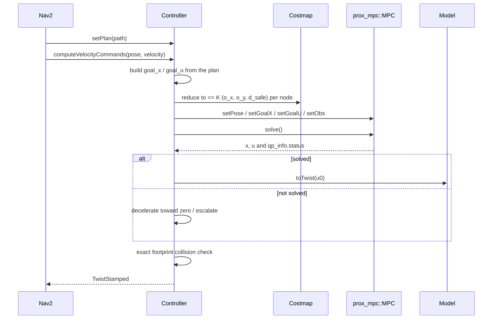

# ProxMpcController — Architecture

This document describes the design of `prox_mpc_controller`, the
[Nav2](https://docs.nav2.org/) controller plugin that drives the
[prox_mpc_core](../../prox_mpc_core) engine.
The controller-side math (reference construction, costmap reduction, and the
failure fallback) is in [control-law.md](control-law.md).
The engine's math is in the core's documents:
[NMPC/SQP/QP](../../prox_mpc_core/docs/nmpc.md) and
[obstacle avoidance](../../prox_mpc_core/docs/obstacle-avoidance.md).

> **Status: skeleton.**
> The plugin satisfies the `nav2_core::Controller` interface, registers as a
> plugin, and constructs a `prox_mpc::MPC`, but `computeVelocityCommands()` is not
> implemented yet — it returns a zero command.
> This document is the design the implementation follows; sections about the
> control law describe intended behavior, not current behavior.

## Responsibility split

The engine and the controller have disjoint, deliberate responsibilities.

`prox_mpc_core` is the frozen math plus a stable extension contract.
It owns the SQP/QP assembly, the cost, the constraints, the linearization, the
disc-based obstacle math, and the `Model` interface.
It is a library with no ROS node and never needs editing to gain a new model.

`prox_mpc_controller` owns model selection and the Nav2 integration.
It loads and configures a concrete model, builds the reference from the global
plan, reduces the local costmap and sensor data to obstacle triples for the core,
maps the optimal control to a `Twist`, handles solver failure, and runs an exact
footprint safety check.
None of that touches the engine's math.

## The Nav2 controller interface

The plugin implements the six `nav2_core::Controller` methods.

| Method | Role |
| --- | --- |
| `configure(parent, name, tf, costmap_ros)` | load and configure the model, build and size the MPC |
| `activate()` / `deactivate()` | enable/disable publishing and processing |
| `cleanup()` | release the MPC, model, costmap, and TF handles |
| `setPlan(path)` | store the global plan to track |
| `computeVelocityCommands(pose, velocity, goal_checker)` | run one control cycle |
| `setSpeedLimit(limit, percentage)` | apply a runtime speed limit |

The class is exported to `nav2_core` through
[../prox_mpc_controller_plugin.xml](../prox_mpc_controller_plugin.xml).

## One-time setup (`configure`)

`configure` builds the controller from the parameter file
([../config/prox_mpc_controller.yaml](../config/prox_mpc_controller.yaml)):

1. Load the model by name with a `pluginlib::ClassLoader<prox_mpc::Model>` using
   `model_plugin` (for example `prox_mpc_core/Bicycle`), then call
   `model->configure(model_params)`.
   The controller **retains the model handle** so it can later apply speed limits
   through `model->updateIneq(...)` and map controls through `model->toTwist(...)`.
2. `mpc_->init(model)`, then set the horizons, step, cost weights, and solver
   limits from the configuration.
3. `mpc_->setMaxObs(K)` (the obstacle-slot capacity per node) and
   `mpc_->configProxQP()` so the QP is sized once.

Because the model is a plugin, selecting a different model is a configuration
change, not a code change.

## Per-cycle control (`computeVelocityCommands`)

Each cycle the controller performs the following steps.

1. **Build the reference.** Convert the stored global plan into the state and
   control references `goal_x` and `goal_u` over the horizon.
2. **Reduce the costmap.** Reduce the local costmap (and sensor obstacle layers)
   to at most `K` `(o_x, o_y, d_safe)` triples per predicted node, and pass them
   with `setObs`.
3. **Set the state.** Feed the current state with `setPose`, tracking any model
   state the Nav2 pose does not provide (the bicycle's steering angle).
4. **Solve.** Call `solve()` and read `qp_info.status`.
5. **Command or brake.** On success, map the first control with
   `model->toTwist(...)`; on failure, apply the deceleration fallback.
6. **Safety check.** Verify the command against an exact polygon-footprint
   collision check before publishing.

Steps 1, 2, 4, and 5 use only existing engine entry points; the reduction, the
reference, and the fallback are derived in [control-law.md](control-law.md).

## Safety layers

Obstacle avoidance is split across two layers.
The engine keeps a fast, convex, disc-based margin inside the optimization, which
shapes the trajectory away from obstacles
(see [obstacle avoidance](../../prox_mpc_core/docs/obstacle-avoidance.md)).
A separate exact polygon-footprint check (a collision monitor or footprint
collision checker) acts as the conservative last line of defense and can veto a
command the optimizer produced.

## Solver-failure handling

`MPC::solve` never commands a stop on its own; it reports convergence through
`qp_info.status` and otherwise returns the last non-converged iterate unchanged.
The controller therefore detects failure and reacts: it decelerates toward zero
within the robot's limits and escalates to a Nav2 recovery after
`max_solver_failures` consecutive failures.
The math is in [control-law.md](control-law.md), and the engine contract is in
[the NMPC document](../../prox_mpc_core/docs/nmpc.md).
