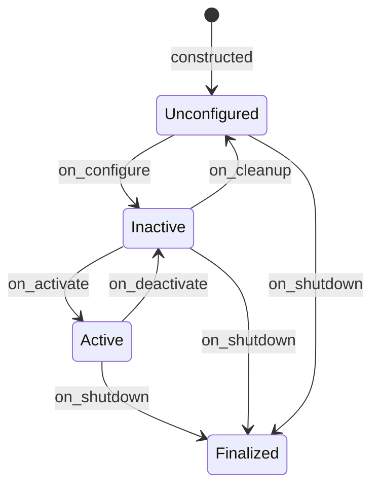

# prox_mpc_obstacle_tracker

An in-house 2D-lidar dynamic-obstacle detector and tracker for ProxMPC.

A managed lifecycle node clusters a `sensor_msgs/LaserScan`, transforms the
cluster centroids into a fixed tracking frame, runs one constant-velocity Kalman
filter per object, and publishes the confirmed tracks as a
[prox_mpc_msgs/ObstacleArray](../prox_mpc_msgs).
That feed is what [prox_mpc_controller](../prox_mpc_controller) consumes for
predictive (dynamic) obstacle avoidance.

The detection and tracking math is written from scratch (Eigen only, no
third-party tracker), so the package is license-clean and unit-testable without
ROS.
The design, algorithm, parameters, and interfaces are documented in
[docs/architecture.md](docs/architecture.md).

## Table of Contents

- [Key Features](#key-features)
- [Prerequisites](#prerequisites)
- [Build](#build)
- [Run](#run)
- [Interfaces](#interfaces)
- [Lifecycle](#lifecycle)
- [Composition](#composition)
- [Testing](#testing)
- [License](#license)

## Key Features

- **Lifecycle node:** managed `configure → activate → deactivate → cleanup`, with
  a signal-safe shutdown ladder in the standalone driver.
- **Self-contained pipeline:** LaserScan → planar points → adjacency clusters →
  tracking-frame centroids → constant-velocity Kalman tracks.
- **Multi-object tracking:** gated greedy nearest-neighbour association, one
  Kalman filter per track, and a birth/confirm/death lifecycle.
- **Wall rejection:** a cluster-radius cap drops extended structure (walls) whose
  centroid would otherwise be tracked as a phantom fast-moving obstacle.
- **Pure core:** the clustering and tracker are a ROS-free Eigen library
  (`prox_mpc_obstacle_tracker_core`) covered by GoogleTest.

## Prerequisites

- ROS 2 Jazzy on Ubuntu 24.04.
- [prox_mpc_msgs](../prox_mpc_msgs) (workspace package).
- `Eigen3`, `rclcpp`, `rclcpp_components`, `rclcpp_lifecycle`, `lifecycle_msgs`,
  `sensor_msgs`, `geometry_msgs`, `tf2`, `tf2_ros` (resolved by `rosdep`).

## Build

```bash
colcon build --symlink-install --packages-select prox_mpc_msgs prox_mpc_obstacle_tracker
source install/setup.bash
```

## Run

The standalone executable is a self-activating lifecycle node: it brings itself up
(`configure → activate`), spins, and tears itself down on `SIGINT`/`SIGTERM`.
The bundled launch file loads [config/obstacle_tracker.yaml](config/obstacle_tracker.yaml)
and wires the node-only logger level, with a `params_file` argument to override the
parameters:

```bash
ros2 launch prox_mpc_obstacle_tracker obstacle_tracker.launch.py
ros2 launch prox_mpc_obstacle_tracker obstacle_tracker.launch.py \
  params_file:=/path/to/custom.yaml
```

To run the executable directly instead of through the launch file:

```bash
ros2 run prox_mpc_obstacle_tracker obstacle_tracker \
  --ros-args --params-file \
  $(ros2 pkg prefix prox_mpc_obstacle_tracker)/share/prox_mpc_obstacle_tracker/config/obstacle_tracker.yaml
```

[config/obstacle_tracker.yaml](config/obstacle_tracker.yaml) is the single source
of truth for the parameters.
Watch the output with:

```bash
ros2 topic echo /tracked_obstacles
```

In simulation the tracker is started automatically by the demo's Nav2 launch with
`predictive:=True` (see
[prox_mpc_demo/docs/nav2-simulation.md](../prox_mpc_demo/docs/nav2-simulation.md)).

## Interfaces

| Interface | Type | QoS | Direction | Description |
| --- | --- | --- | --- | --- |
| `scan` (configurable) | `sensor_msgs/msg/LaserScan` | `SensorDataQoS` (best-effort, depth 1) | Subscribed | Input lidar scan; subscribed on activate. |
| `tracked_obstacles` (configurable) | `prox_mpc_msgs/msg/ObstacleArray` | reliable, depth 5 | Published | Confirmed tracks in the tracking frame. |

The node also requires the TF `tracking_frame ← scan_frame` to place the obstacles
in the tracking frame.
The full parameter and lifecycle reference is in
[docs/architecture.md](docs/architecture.md).

## Lifecycle

The node is a managed lifecycle node.
The standalone `obstacle_tracker` executable is a self-activating driver: it walks
the node up (`configure → activate`), spins, and on `SIGINT`/`SIGTERM` runs a
single checked finalize ladder (`deactivate → cleanup → shutdown`); a second
signal force-quits.



`on_configure` declares and validates every parameter, builds the tracker, the TF
buffer/listener, and the publisher; `on_activate` resets the tracker and creates
the scan subscription so processing begins; `on_deactivate` drops the subscription
and stops output; `on_cleanup` and `on_shutdown` release resources through one
idempotent teardown path.
Per-transition detail is in [docs/architecture.md](docs/architecture.md).

## Composition

The lifecycle node is also registered as an `rclcpp_components` node
(`prox_mpc_obstacle_tracker::ObstacleTrackerNode`), so it can be loaded into a
shared-process component container instead of the standalone executable:

```bash
ros2 run rclcpp_components component_container
ros2 component load /ComponentManager prox_mpc_obstacle_tracker \
  prox_mpc_obstacle_tracker::ObstacleTrackerNode
```

When loaded as a component the lifecycle transitions are driven externally (the
container does not self-activate the node); the standalone executable is the path
that brings itself up.

## Testing

```bash
colcon test --packages-select prox_mpc_obstacle_tracker
colcon test-result --all --verbose
```

Three GoogleTest suites run.
`test_clustering` and `test_tracker` cover the ROS-free core: scan-to-points and
adjacency segmentation (including the wall-radius cap), and the constant-velocity
filter, association, and birth/confirm/death lifecycle.
`test_obstacle_tracker_node` is a lifecycle-node integration test that drives the
transition ladder and the scan-to-publish path against a synthetic scan.
`uncrustify` is the enforced C++ formatter; `cpplint` and `ament_copyright` are
disabled (short SPDX header per file; full text in [LICENSE](../LICENSE)).

## License

[Apache-2.0](../LICENSE).
